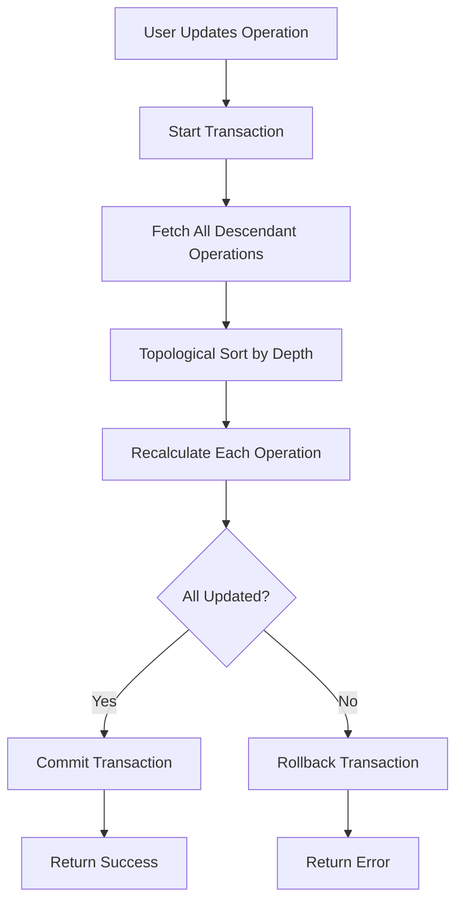

# Tree Update Algorithm Documentation

## Overview

The **Tree Update Algorithm** ensures data integrity when an operation in the calculation tree is modified. When a user updates an operation's value or type, all descendant operations must be recalculated to maintain accurate totals throughout the tree.

### Purpose

- Maintain calculation accuracy across the entire operation tree
- Ensure atomic updates (all or nothing) using database transactions
- Prevent orphaned or incorrect calculations
- Handle complex tree structures with multiple branches

## Algorithm Workflow

### High-Level Steps



### Detailed Steps

#### 1. **Trigger Update**

When an operation is updated (value or type changed), the system calls `recalculateOperationTree(operationId)`.

#### 2. **Start Database Transaction**

```typescript
await prisma.$transaction(async (tx) => {
  // All operations happen within this transaction
});
```

**Why?** Ensures atomicity - if any step fails, all changes are rolled back.

#### 3. **Fetch Descendant Operations**

Recursively fetch all operations that depend on the updated operation.

```typescript
async function getDescendantOperations(operationId: number, tx: PrismaTransaction) {
  const children = await tx.operation.findMany({
    where: { parentId: operationId },
  });

  const descendants = [...children];

  for (const child of children) {
    const childDescendants = await getDescendantOperations(child.id, tx);
    descendants.push(...childDescendants);
  }

  return descendants;
}
```

#### 4. **Topological Sort**

Sort operations by depth (parents before children) to ensure correct calculation order.

```typescript
function topologicalSort(operations: Operation[]): Operation[] {
  // Build dependency graph
  const graph = new Map<number, number[]>();
  const inDegree = new Map<number, number>();

  // Sort using Kahn's algorithm or depth-first traversal
  // Returns operations in order: root → leaves
}
```

#### 5. **Recalculate Each Operation**

For each operation in sorted order:

1. Fetch parent operation
2. Calculate new total based on parent's `afterValue`
3. Update `beforeValue` and `afterValue`

```typescript
for (const op of sorted) {
  const parent = await tx.operation.findUnique({
    where: { id: op.parentId },
  });

  const newTotal = calculateOperation(
    parent.afterValue, // beforeValue for current operation
    op.operationType, // ADD, SUBTRACT, MULTIPLY, DIVIDE
    op.value // operand value
  );

  await tx.operation.update({
    where: { id: op.id },
    data: {
      beforeValue: parent.afterValue,
      afterValue: newTotal,
    },
  });
}
```

#### 6. **Commit or Rollback**

- **Success**: All operations updated → Commit transaction
- **Failure**: Any error occurs → Rollback all changes

## Example Scenarios

### Scenario 1: Updating a Middle Node

**Initial Tree:**

```text
Discussion (startingValue: 100)
  └─ Op1: +50 = 150
      ├─ Op2: ×2 = 300
      │   └─ Op4: -50 = 250
      └─ Op3: ÷3 = 50
```

**User updates Op1 from +50 to +100**

**Process:**

1. Fetch descendants: `[Op2, Op3, Op4]`
2. Sort by depth: `[Op2, Op3, Op4]`
3. Recalculate:
   - Op1: 100 + 100 = 200 ✓
   - Op2: 200 × 2 = 400 (was 300)
   - Op3: 200 ÷ 3 = 66.67 (was 50)
   - Op4: 400 - 50 = 350 (was 250)

**Result Tree:**

```text
Discussion (startingValue: 100)
  └─ Op1: +100 = 200
      ├─ Op2: ×2 = 400
      │   └─ Op4: -50 = 350
      └─ Op3: ÷3 = 66.67
```

### Scenario 2: Updating a Leaf Node

**Tree:**

```text
Discussion (startingValue: 10)
  └─ Op1: +5 = 15
      └─ Op2: ×2 = 30
```

**User updates Op2 from ×2 to ×3**

**Process:**

1. Fetch descendants: `[]` (no children)
2. Recalculate:
   - Op2: 15 × 3 = 45 (was 30)

**Result:** Only Op2 is updated. No cascade needed.

### Scenario 3: Updating Root Operation

**Tree:**

```text
Discussion (startingValue: 50)
  └─ Op1: +50 = 100
      ├─ Op2: -20 = 80
      └─ Op3: ÷2 = 50
```

**User updates Op1 from +50 to +150**

**Process:**

1. Fetch descendants: `[Op2, Op3]`
2. Recalculate:
   - Op1: 50 + 150 = 200
   - Op2: 200 - 20 = 180 (was 80)
   - Op3: 200 ÷ 2 = 100 (was 50)

**Impact:** Entire tree recalculated.

## Transaction Handling

### Atomic Updates

```typescript
try {
  await prisma.$transaction(async (tx) => {
    // All updates here
  });
  return { success: true };
} catch (error) {
  // Transaction automatically rolled back
  return { success: false, error };
}
```

### Rollback Scenarios

**When does rollback occur?**

- Database constraint violation
- Network error during update
- Invalid operation type
- Division by zero
- Parent operation not found

**Example:**

```typescript
// If Op3 update fails, Op1 and Op2 updates are also rolled back
await prisma.$transaction(async (tx) => {
  await tx.operation.update({ where: { id: 1 }, data: { ... } }); // ✓
  await tx.operation.update({ where: { id: 2 }, data: { ... } }); // ✓
  await tx.operation.update({ where: { id: 3 }, data: { ... } }); // ✗ FAILS
  // All changes rolled back automatically
});
```

## Performance Considerations

### Time Complexity

- **Best Case**: O(1) - Updating a leaf node with no children
- **Average Case**: O(n) - Where n = number of descendants
- **Worst Case**: O(n log n) - Deep tree with topological sort

### Optimization Strategies

1. **Batch Updates**

   ```typescript
   // Instead of individual updates
   await tx.operation.updateMany({
     where: { id: { in: operationIds } },
     data: { ... }
   });
   ```

2. **Limit Tree Depth**
   - Consider maximum depth limit (e.g., 100 levels)
   - Prevent infinite recursion

3. **Caching**
   - Cache parent operations during traversal
   - Reduce database queries

4. **Parallel Processing** (Future Enhancement)
   - Update independent branches in parallel
   - Requires careful transaction management

### Database Load

**Typical Update:**

- 1 operation updated → 1 query
- 5 descendants → 5 queries
- **Total**: ~6 queries within 1 transaction

**Large Tree:**

- 1 operation updated → 1 query
- 100 descendants → 100 queries
- **Total**: ~101 queries within 1 transaction
- **Duration**: ~500ms - 2s (depending on database)

## Edge Cases & Error Handling

### Edge Case 1: Circular Dependencies

**Problem:** Op1 → Op2 → Op3 → Op1 (cycle)

**Solution:**

- Prisma schema prevents this with `parentId` foreign key
- Validation ensures `parentId ≠ id`

### Edge Case 2: Division by Zero

**Problem:** User updates operation to `÷ 0`

**Solution:**

```typescript
if (operationType === 'DIVIDE' && value === 0) {
  throw new BadRequestError('Cannot divide by zero');
}
```

### Edge Case 3: Orphaned Operations

**Problem:** Parent operation deleted but children remain

**Solution:**

- Prisma cascade delete: `onDelete: Cascade`
- When parent is deleted, all children are automatically deleted

### Edge Case 4: Concurrent Updates

**Problem:** Two users update the same operation simultaneously

**Solution:**

- Database transaction isolation level: `READ COMMITTED`
- Last write wins (or implement optimistic locking with version field)

### Edge Case 5: Very Deep Trees

**Problem:** Tree with 1000+ levels causes stack overflow

**Solution:**

- Implement iterative traversal instead of recursive
- Set maximum depth limit
- Use queue-based BFS instead of DFS

## API Endpoint

### Update Operation

**Endpoint:** `PATCH /operation/:operationId`

**Request Body:**

```json
{
  "value": 100,
  "operationType": "ADD"
}
```

**Response:**

```json
{
  "success": true,
  "message": "Operation updated and tree recalculated",
  "data": {
    "updatedOperation": { ... },
    "affectedOperations": 5
  }
}
```

**Error Response:**

```json
{
  "success": false,
  "error": "Cannot divide by zero",
  "statusCode": 400
}
```

## Testing Strategy

### Unit Tests

```typescript
describe('recalculateOperationTree', () => {
  it('should update all descendants when root is updated', async () => {
    // Test implementation
  });

  it('should rollback on error', async () => {
    // Test implementation
  });

  it('should handle leaf node updates without cascade', async () => {
    // Test implementation
  });
});
```

### Integration Tests

- Test with real database
- Verify transaction rollback
- Test concurrent updates

### Performance Tests

- Benchmark with 10, 100, 1000 descendants
- Measure transaction duration
- Test under load

## Future Enhancements

1. **Optimistic Locking**
   - Add `version` field to operations
   - Prevent lost updates in concurrent scenarios

2. **Event Sourcing**
   - Store all changes as events
   - Enable audit trail and undo functionality

3. **Websocket Notifications**
   - Notify connected clients when tree is updated
   - Real-time collaboration

4. **Partial Updates**
   - Only recalculate affected branches
   - Skip independent subtrees

5. **Caching Layer**
   - Cache frequently accessed trees
   - Invalidate on update
